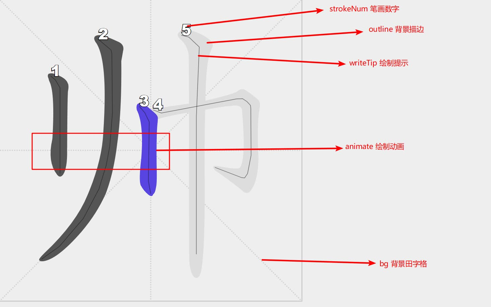

# quick-chinese-transfer

[](https://travis-ci.org/liuyueyi/quick-chinese-transfer)
[](https://search.maven.org/search?q=a:quick-transfer-core)
[](https://jitpack.io/#liuyueyi/quick-chinese-transfer)
[](https://codecov.io/gh/liuyueyi/quick-chinese-transfer)
[](http://isitmaintained.com/project/liuyueyi/quick-chinese-transfer "Average time to resolve an issue")
[](http://isitmaintained.com/project/liuyueyi/quick-chinese-transfer "Percentage of issues still open")

两个插件:

- [简繁转换](transfer-core)
- [汉字笔画](hanzi-writer)

## 简繁转换 (transfer-core)

简体中文，繁体中文，香港繁体，台湾繁体 相互转换的Java库

本项目主要来自于

- [https://github.com/hankcs/HanLP](https://github.com/hankcs/HanLP)
- [https://github.com/luhuiguo/chinese-utils](https://github.com/luhuiguo/chinese-utils)

词典更新维护来自：

- [https://github.com/hankcs/HanLP/tree/1.x/data/dictionary/tc](https://github.com/hankcs/HanLP/tree/1.x/data/dictionary/tc)

### 使用姿势

**maven依赖**

中央仓库导入依赖

```xml
<!-- https://mvnrepository.com/artifact/com.github.liuyueyi/quick-transfer-core -->
<dependency>
    <groupId>com.github.liuyueyi</groupId>
    <artifactId>quick-transfer-core</artifactId>
    <version>0.2.15</version>
</dependency>
```

**中央仓库 gradle**

```gradle
// https://mvnrepository.com/artifact/com.github.liuyueyi/quick-transfer-core
implementation 'com.github.liuyueyi:quick-transfer-core:0.2.14'
```

**使用jitpack导入依赖**

```xml

<repositories>
    <repository>
        <id>jitpack.io</id>
        <url>https://jitpack.io</url>
    </repository>
</repositories>

<dependency>
<groupId>com.github.liuyueyi.quick-chinese-transfer</groupId>
<artifactId>quick-transfer-core</artifactId>
<version>0.2.15</version>
</dependency>
```

**gradle依赖**

```gradle
allprojects {
	repositories {
		...
		maven { url 'https://jitpack.io' }
	}
}

dependencies {
    implementation 'com.github.liuyueyi.quick-chinese-transfer:quick-transfer-core:0.2.15'
}
```

**基本使用演示**

```java
public void testTrans() {
    String text = "这斜月三星洞…… 长寿面，孙悟空，猪八戒，唐僧，沙和尚，白龙马，李靖，托塔天王, 戏说西游，许多人都这样说，收拾一下，拾金不昧；纔=才";
    String out = ChineseUtils.s2t(text);
    System.out.println("s2t -->" + out);
    String hkOut = ChineseUtils.s2hk(text);
    System.out.println("s2hk -->" + hkOut);
    String twOut = ChineseUtils.s2tw(text);
    System.out.println("s2tw --> " + twOut);

    String origin = ChineseUtils.t2s(out);
    System.out.println("t2s -->" + origin);
    System.out.println("hk2s -->" + ChineseUtils.hk2s(hkOut));
    System.out.println("tw2s -->" + ChineseUtils.tw2s(twOut));
}
```

输出结果如下

```text
s2t -->這斜月三星洞…… 長壽麪，孫悟空，豬八戒，唐僧，沙和尚，白龍馬，李靖，托塔天王, 戲說西遊，許多人都這樣說，收拾一下，拾金不昧；纔=才
s2hk -->這斜月三星洞…… 長壽麪，孫悟空，豬八戒，唐僧，沙和尚，白龍馬，李靖，托塔天王, 戲説西遊，許多人都這樣説，收拾一下，拾金不昧；才=才
s2tw --> 這斜月三星洞…… 長壽麵，孫悟空，豬八戒，唐僧，沙和尚，白龍馬，李靖，托塔天王, 戲說西遊，許多人都這樣說，收拾一下，拾金不昧；才=才
t2s -->这斜月三星洞…… 长寿面，孙悟空，猪八戒，唐僧，沙和尚，白龙马，李靖，托塔天王, 戏说西游，许多人都这样说，收拾一下，拾金不昧；才=才
hk2s -->这斜月三星洞…… 长寿面，孙悟空，猪八戒，唐僧，沙和尚，白龙马，李靖，托塔天王, 戏说西游，许多人都这样说，收拾一下，拾金不昧；才=才
tw2s -->这斜月三星洞…… 长寿面，孙悟空，猪八戒，唐僧，沙和尚，白龙马，李靖，托塔天王, 戏说西游，许多人都这样说，收拾一下，拾金不昧；才=才
```

### 高性能接入

**词典预加载**

> 当系统对性能要求较高时，可以考虑提前异步加载词典、避免首次使用加载词典导致开销高

```java
// 预热加载所有的词典
ChineseUtils.preLoad(true,TransType.values());

// 预加载简体转繁体词典
        ChineseUtils.

preLoad(true,TransType.SIMPLE_TO_TRADITIONAL);

// 预加载简繁互转词典
ChineseUtils.

preLoad(true,TransType.SIMPLE_TO_TRADITIONAL, TransType.TRADITIONAL_TO_SIMPLE);
```

**卸载**

> 当内存敏感时，提前卸载无用词典减少内存占用

```java
// 卸载所有词典
ChineseUtils.unLoad(TransType.values());

// 卸载简繁互转词典
        ChineseUtils.

unLoad(TransType.SIMPLE_TO_TRADITIONAL, TransType.TRADITIONAL_TO_SIMPLE);
```

**转换**

ChineseUtils封装了通用的字体转换接口，可以直接通过下面的方式实现转换

```java
ChineseUtils.transfer("一灰灰blog",TransType.SIMPLE_TO_TRADITIONAL);
```

**加载自定义转换词典**

> 若有一些自定义的转换词典，希望加载到转换词典中，可以调用下面的方法进行初始化

在 0.2.16 以及之后的版本中，提供了自定义词典加载功能，使用姿势

```java
Map<String, String> map = new HashMap<>();
map.put("发展国家", "發达國家");
ChineseUtils.loadAdditionalDict(TransType.SIMPLE_TO_TRADITIONAL, map);
```

**加载不参与转换的词典**

> 若自带的转换词典不满足需求，可以使用下面的方式将不参与转换的词加入词典

在 0.2.16 以及之后的版本中，提供了自定义过滤词库加载功能，使用姿势如下

```java
// 简繁转换中，我们不希望将 国 -> 转换为 國， 不希望将 发展国家 转换为 發展國家
ChineseUtils.loadExcludeDict(TransType.SIMPLE_TO_TRADITIONAL, Arrays.asList("发展国家", "国"));

// 验证示例:
System.out.println("加载自定义词典后：简=>繁 ==>" + ChineseUtils.s2t("中华人民共和国目前还处于发展国家行列，但他依然在快速发展中"));

// 输出内容为： 加载自定义过滤词后：简=>繁 ==>中華人民共和国目前還處於发展国家行列，但他依然在快速發展中
```

上面适用于指定具体的某种转换类型，也可以使用下面的方式将不参与转换的词加入全局的转换中，这样实现不管是什么类型的转换，都维持原状

```java
ChineseUtils.loadExcludeDict(Arrays.asList("发展国家", "国"));
```

### 版本说明
- 0.2.16
    - [#18 新增自定义词库加载，自定义排除词加载](https://github.com/liuyueyi/quick-chinese-transfer/issues/18)
- 0.2.15
    - [#23 繁简转换问题](https://github.com/liuyueyi/quick-chinese-transfer/issues/23)
- 0.2.14
    - [#17 繁简转换问题](https://github.com/liuyueyi/quick-chinese-transfer/issues/17)
    - [#19 繁简转换问题](https://github.com/liuyueyi/quick-chinese-transfer/issues/19)
- 0.2.13
    - [#15 那么"标致"和"溜"繁简转换问题](https://github.com/liuyueyi/quick-chinese-transfer/issues/15)
- 0.2.12
    - [#14 那么”繁简转换问题](https://github.com/liuyueyi/quick-chinese-transfer/issues/14)
- 0.2.11
    - [#13 “福斯”繁简转换问题](https://github.com/liuyueyi/quick-chinese-transfer/issues/13)
- 0.2.10
    - [#12 快取 高速缓存](https://github.com/liuyueyi/quick-chinese-transfer/issues/12)
- 0.2.9
    - [#11 娘 对象 签简体转繁体](https://github.com/liuyueyi/quick-chinese-transfer/issues/11)
- 0.2.8
    - [#10 翻转简 洛哈=>洛哈特](https://github.com/liuyueyi/quick-chinese-transfer/issues/10)
- 0.2.7
    - [#9 繁转简 通道会变信道](https://github.com/liuyueyi/quick-chinese-transfer/issues/9)
- 0.2.6
    - [#8 繁转简： 那個人=>神秘人](https://github.com/liuyueyi/quick-chinese-transfer/issues/8)
- 0.2.5
    - 删除 `唇<=>脣` 简繁转换
        - [#6 修正簡繁轉換：唇<=>脣](https://github.com/liuyueyi/quick-chinese-transfer/issues/6)
    - 支持同步/异步预加载词典、卸载词典
        - [#7 支持词典异步预加载、卸载](https://github.com/liuyueyi/quick-chinese-transfer/issues/7)
- 0.2.4
    - 繁体转简体
        - [#5 骼 繁转简错误](https://github.com/liuyueyi/quick-chinese-transfer/issues/5)
- 0.2.3
    - 繁体转简体
        - [#4 乾 繁转简错误](https://github.com/liuyueyi/quick-chinese-transfer/issues/4)
- 0.2.2
    - 繁转简
        - [#3 克拉转成克拉布](https://github.com/liuyueyi/quick-chinese-transfer/issues/3)
- 0.2.1
    - 繁转简： fix 奔驰，奶油，黄油转换异常
- 0.2.0
    - 修复链式转换
- 0.1.0
    - 简繁转换

## 汉字笔画 (hanzi-writer)

中文汉字的笔画拆解、动画绘制

数字字典来自

- [https://github.com/chanind/hanzi-writer](https://github.com/chanind/hanzi-writer)

### 使用姿势

**maven依赖**

中央仓库导入依赖

```xml
<!-- https://mvnrepository.com/artifact/com.github.liuyueyi/quick-transfer-core -->
<dependency>
    <groupId>com.github.liuyueyi</groupId>
    <artifactId>hanzi-writer</artifactId>
    <version>0.1.0</version>
</dependency>
```

**中央仓库 gradle**

```gradle
// https://mvnrepository.com/artifact/com.github.liuyueyi/quick-transfer-core
implementation 'com.github.liuyueyi:hanzi-writer:0.1.0'
```

**使用jitpack导入依赖**

```xml

<repositories>
    <repository>
        <id>jitpack.io</id>
        <url>https://jitpack.io</url>
    </repository>
</repositories>

<dependency>
<groupId>com.github.liuyueyi.quick-chinese-transfer</groupId>
<artifactId>hanzi-writer</artifactId>
<version>0.2.14</version>
</dependency>
```

**gradle依赖**

```gradle
allprojects {
	repositories {
		...
		maven { url 'https://jitpack.io' }
	}
}

dependencies {
    implementation 'com.github.liuyueyi.quick-chinese-transfer:hanzi-writer:0.2.14'
}
```

**基本使用演示**

```java
HanZiRenderResultVo vo = HanZiSvgGenerator
        .newGenerator("帅")
        .setRenderStyle(RenderStyleEnum.TOTAL)
        .setStrokeNumShow(true)
        .setAnimateShow(true)
        .setOutlineShow(true)
        .setWriteTipShow(true)
        .toSvgs();

// svg 表示带动画 + 笔画 的svg格式
String svg = vo.getSvg();
// 逐笔绘制的效果
List<String> strokeSvgList = vo.getStrokes();
```

几个关键的参数配置



| 参数               | 类型        | 说明                            | 默认值                                                                                                                                                                                                                                                                   
|------------------|-----------|-------------------------------|-----------------------------------------------------------------------------------------------------------------------------------------------------------------------------------------------------------------------------------------------------------------------|
| `size`           | `int`     | 输出svg大小                       | `300`                                                                                                                                                                                                                                                                 |
| `bgShow`         | `boolean` | 是否显示背景的田字格                    | `true`                                                                                                                                                                                                                                                                |
| `bg`             | `string`  | 背景信息，田字格                      | `<g stroke="lightgray"stroke-dasharray="1,1"stroke-width="1"transform="scale(4, 4)"><line x1="0"y1="0"x2="256"y2="256"></line><line x1="256"y1="0"x2="0"y2="256"></line><line x1="128"y1="0"x2="128"y2="256"></line><line x1="0"y1="128"x2="256"y2="128"></line></g>` |
| `outlineShow`    | `boolean` | 是否显示背景描边                      | `true`                                                                                                                                                                                                                                                                | 
| `outlineColor`   | `string`  | 背景描边色                         | `rgba(221,221,221,1)`                                                                                                                                                                                                                                                 |
| `animateShow`    | `boolean` | 是否支持按笔画顺序进行动画展示               | `true`                                                                                                                                                                                                                                                                | 
| `drawColor`      | `string`  | 动画执行完之后的颜色                    | `rgb(85, 85, 85)`                                                                                                                                                                                                                                                     |
| `midColor`       | `string`  | 动画执行过程中的颜色                    | `rgb(68, 68, 255)`                                                                                                                                                                                                                                                    |
| `animateColor`   | `string`  | 动画开始执行的颜色                     | `rgb(187, 68, 68)`                                                                                                                                                                                                                                                    |
| `animateSeconds` | `float`   | 动画时长(秒)                       | `0.9`                                                                                                                                                                                                                                                                 |
| `writeTipShow`   | `boolean` | 是否显示绘制轮廓的提示                   | `true`                                                                                                                                                                                                                                                                |
| `writeTipStyle`  | `string`  | 轮廓的提示样式                       | `.median-stroke{fill:none;stroke:rgb(15,15,15,0.5);stroke-width:2px;opacity:1}`                                                                                                                                                                                       |
| `strokeNumShow`  | `boolean` | 是否显示笔画顺序的文字                   | `true`                                                                                                                                                                                                                                                                |
| `strokeNumStyle` | `string`  | 笔画提示数字的格式                     | `text{font-family:Helvetica;font-size:50px;fill:#ffffff;paint-order:stroke;stroke:#000000;stroke-width:4px;stroke-linecap:butt;stroke-linejoin:miter;font-weight:800}`                                                                                                |
| `renderStyle`    | `enum`    | `NORMAL,STROKE_ANIMATE,TOTAL` | normal 表示只返回最终的svg, stroke_animate表示只返回笔画拆分结果,total前面两个都返回                                                                                                                                                                                                            |

对应的svg显示样式如下


| 1                                                | 2                                                | 3                                                | 4                                                | 5                                                |
|--------------------------------------------------|--------------------------------------------------|--------------------------------------------------|--------------------------------------------------|--------------------------------------------------|
|  |  |  |  |  |

### 版本说明

- 0.1.0
    - 完成初始版本
